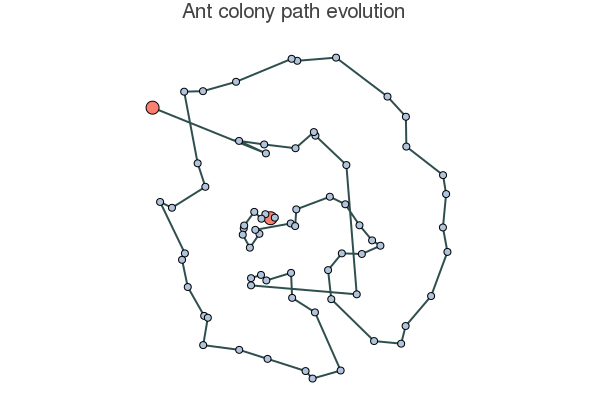

# Ant Colony Optimization

<p align="center">
    
</p>


[AntColony.jl](https://github.com/schiegl/AntColony.jl) implements elements from various types of ant colony algorithms. The types of algorithms are [MAX-MIN Ant System (MMAS)](https://en.wikipedia.org/wiki/Ant_colony_optimization_algorithms#Max-Min_Ant_System_(MMAS)), [Elitist Ant System](https://en.wikipedia.org/wiki/Ant_colony_optimization_algorithms#Elitist_Ant_System) and [Ant Colony System (ACS)](https://en.wikipedia.org/wiki/Ant_colony_optimization_algorithms#Ant_Colony_System_(ACS)).
This implementation is elitist in the sense that only the ants which found the shortest paths this iteration deposit pheromones on their trails.
In order to avoid being trapped in a local optimum ants select the next node [roulette wheel style](https://en.wikipedia.org/wiki/Fitness_proportionate_selection), often used in ACS.
Furthermore pheromone levels are reset after a user defined number of non-improving iterations while also being limited to a range, which is commonly found in MMAS.


## Install
```julia
Pkg.add("AntColony")
```

## Usage
### Import the library
This brings the function `aco` (short for ant colony optimization) into the scope.

```julia
using AntColony
```

### Define your optimization problem
Create a [distance matrix](https://en.wikipedia.org/wiki/Distance_matrix) which defines the cost of travelling between nodes. Note that this matrix represents a directed graph and therefore the matrix need not be symmetric.

```julia
distance_matrix = rand(10, 10)
# note that distance_matrix[3, 5] = travel distance from node 5 to node 3 
```

### Find a tour
Find a path which visits all nodes and returns to the start node. Note the function doesn't return the start node twice.

```julia
aco(distance_matrix, is_tour = true)
```

### Find a path
Find a path with a specific start and end node

```julia
aco(distance_matrix, start_node = 1, end_node = 5)
```

### Best hyperparameters?
There are lots of parameters that can be tweaked. The algorithm is generally fairly robust meaning that slight changes in parameters should not result in drastically different performance.

I recommend reading up on ant colony optimization algorithms as all the parameter names this package uses are notation commonly used in the literature. However if you don't feel like it, the first parameters worth playing around with might be: `max_iter`, `q`, `beta` and `top_perc_ants`

`max_iter` is simply the maximum number of iterations the algorithm will spend trying to find better solutions. If you'd like to decrease the greedyness of the algorithm `q` will increase the amount of randomness involved in deciding which node to travel to next. `top_perc_ants` has a similar effect in that convergence will speed up since only the best solutions influence the search. Finally `beta` allows you to scale the the importance of distance in the decision process compared to the pheromone level.